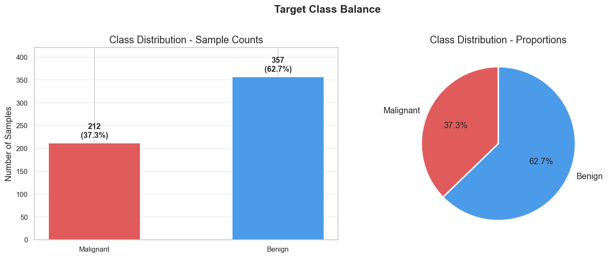
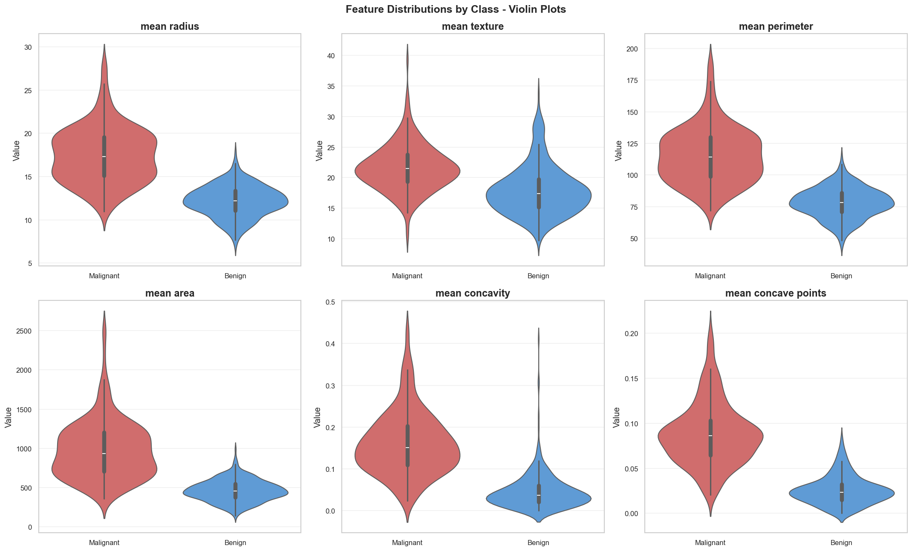
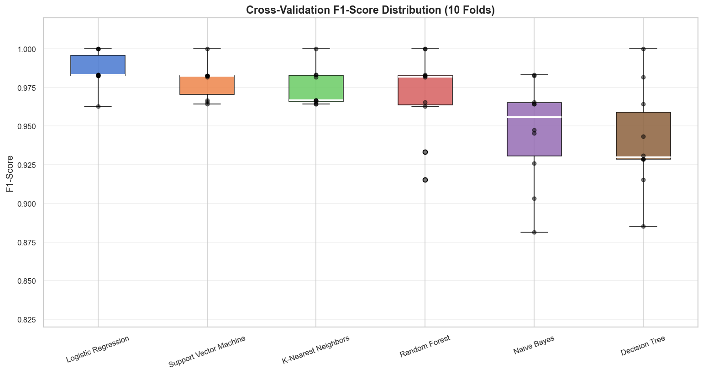
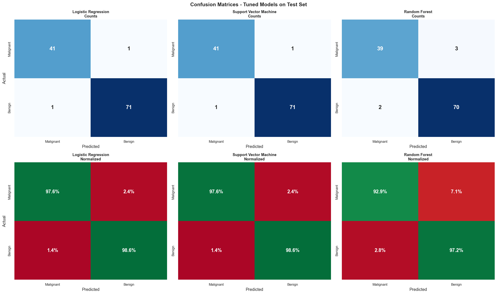
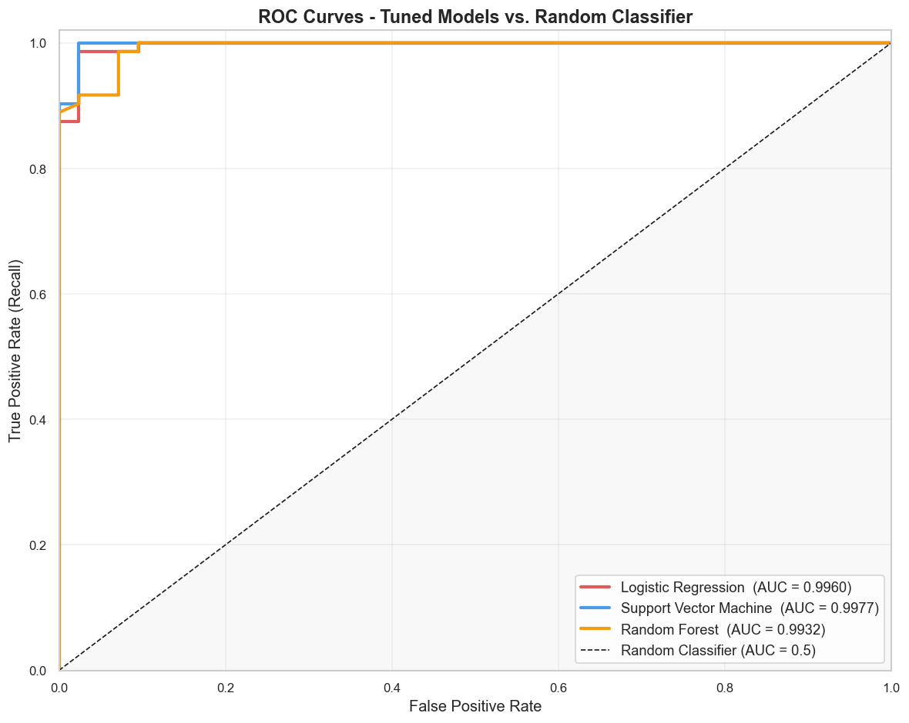
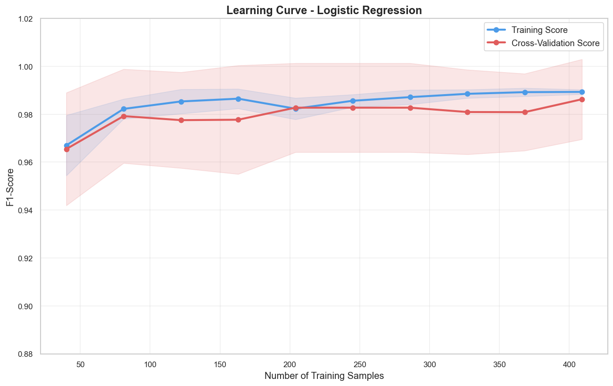

# Breast Cancer Classification: A Comparative Machine Learning Study

A complete, end-to-end machine learning project that trains and evaluates six
classification algorithms on the Wisconsin Breast Cancer dataset. The goal is
to identify which algorithm most reliably distinguishes malignant from benign
tumors using cell nucleus measurements from biopsy samples.

---

## Table of Contents

- [Project Overview](#project-overview)
- [Dataset](#dataset)
- [Project Structure](#project-structure)
- [Machine Learning Pipeline](#machine-learning-pipeline)
- [Results](#results)
- [Key Visualizations](#key-visualizations)
- [How to Run](#how-to-run)
- [Requirements](#requirements)
- [Limitations](#limitations)
- [Author](#author)

---

## Project Overview

Most machine learning tutorials train one model and stop. This project takes
a different approach. Six algorithms are trained under identical conditions,
validated through 10-fold stratified cross-validation, and the top three
candidates are tuned with GridSearchCV. Every decision in the pipeline is
justified, every result is traceable, and every chart is saved to disk.

The project follows the industry-standard ML workflow from raw data to a
final recommendation backed by multiple evaluation methods.

---

## Dataset

**Source:** Wisconsin Breast Cancer Dataset via `sklearn.datasets`

| Property | Value |
|---|---|
| Samples | 569 patients |
| Features | 30 numerical features |
| Target classes | Malignant (0), Benign (1) |
| Class distribution | 37.3% Malignant, 62.7% Benign |
| Missing values | None |

Features are computed from digitized images of fine needle aspirate (FNA)
biopsy samples. They describe characteristics of cell nuclei including
radius, texture, perimeter, area, smoothness, compactness, concavity,
symmetry, and fractal dimension. Each characteristic is represented three
times: as a mean, a standard error, and a worst (largest) value.

---

## Project Structure

```
breast-cancer-classification/
│
├── breast_cancer_classification.ipynb   # Main notebook
│
├── images/                              # All charts saved automatically
│   ├── 01_class_distribution.png
│   ├── 02_mean_feature_distributions.png
│   ├── 03_violin_plots_by_class.png
│   ├── 04_kde_by_class.png
│   ├── 05_feature_separation_scores.png
│   ├── 06_correlation_matrix.png
│   ├── 07_target_correlation.png
│   ├── 08_pair_plot_top_features.png
│   ├── 09_scaling_comparison.png
│   ├── 10_baseline_model_comparison.png
│   ├── 11_malignant_recall_comparison.png
│   ├── 12_cv_f1_distribution.png
│   ├── 13_cv_mean_scores.png
│   ├── 14_tuning_comparison.png
│   ├── 15_confusion_matrices.png
│   ├── 16_roc_curves.png
│   ├── 17_learning_curve.png
│   ├── 18_feature_importance.png
│   └── 19_final_overview.png
│
└── README.md
```

---

## Machine Learning Pipeline

| Phase | Description |
|---|---|
| 1 | Project setup: imports, global settings, output folder |
| 2 | Data loading and audit: shape, types, nulls, class balance |
| 3 | EDA: distributions, violin plots, KDE by class, separation scores |
| 4 | EDA: correlation matrix, target correlation, pair plots |
| 5 | Preprocessing: stratified train-test split, StandardScaler |
| 6 | Baseline comparison: six algorithms trained and ranked |
| 7 | Cross-validation: 10-fold stratified CV for all six models |
| 8 | Hyperparameter tuning: GridSearchCV on top three models |
| 9 | Final evaluation: classification reports, confusion matrices, ROC curves, learning curves |
| 10 | Conclusion: feature importance, full overview, limitations, ethical considerations |

---

## Results

### Baseline Comparison (Test Set, No Tuning)

| Model | Accuracy | F1-Score | Malignant Recall |
|---|---|---|---|
| Logistic Regression | 0.9825 | 0.9861 | 0.9762 |
| Support Vector Machine | 0.9825 | 0.9861 | 0.9762 |
| K-Nearest Neighbors | 0.9561 | 0.9655 | 0.9286 |
| Random Forest | 0.9561 | 0.9655 | 0.9286 |
| Naive Bayes | 0.9298 | 0.9444 | 0.9048 |
| Decision Tree | 0.9123 | 0.9286 | 0.9286 |

### Cross-Validation Results (10-Fold Stratified)

| Model | CV F1 Mean | CV F1 Std |
|---|---|---|
| Logistic Regression | 0.9859 | 0.0109 |
| Support Vector Machine | 0.9791 | 0.0103 |
| K-Nearest Neighbors | 0.9742 | 0.0115 |
| Random Forest | 0.9707 | 0.0261 |
| Naive Bayes | 0.9463 | 0.0319 |
| Decision Tree | 0.9407 | 0.0317 |

### Final Evaluation - Tuned Models

| Model | F1-Score | Malignant Recall | ROC-AUC | Missed Cases |
|---|---|---|---|---|
| Support Vector Machine | 0.9861 | 0.9762 | 0.9977 | 1 of 42 |
| Logistic Regression | 0.9861 | 0.9762 | 0.9960 | 1 of 42 |
| Random Forest | 0.9655 | 0.9286 | 0.9932 | 3 of 42 |

**Recommended model: Support Vector Machine** (C=10, gamma=0.01, kernel=rbf)

It leads on ROC-AUC at 0.9977, matches the highest F1-Score and accuracy,
and has the lowest cross-validation standard deviation of all six models
at 0.0103. That combination of peak performance and consistency makes it
the most reliable classifier in this study.

---

## Key Visualizations

### Class Distribution


### Feature Separation by Class


### Cross-Validation F1 Distribution


### Confusion Matrices


### ROC Curves


### Learning Curve


---

## How to Run

**1. Clone the repository**
```bash
git clone https://github.com/arberzylyftari/breast-cancer-classification.git
cd breast-cancer-classification
```

**2. Install dependencies**
```bash
pip install numpy pandas matplotlib seaborn scikit-learn jupyter
```

**3. Launch the notebook**
```bash
jupyter notebook breast_cancer_classification.ipynb
```

**4. Run all cells**

From the menu bar select Kernel, then Restart and Run All. The notebook
runs top to bottom with no errors. All charts are saved automatically
to the images/ folder.

No external dataset download is required. The Wisconsin Breast Cancer
dataset is loaded directly from scikit-learn.

---

## Requirements

```
numpy
pandas
matplotlib
seaborn
scikit-learn
jupyter
```

Install all at once:
```bash
pip install numpy pandas matplotlib seaborn scikit-learn jupyter
```

Tested with Python 3.8 and above.

---

## Limitations

- The dataset comes from a single institution. Performance may differ on
  data from different imaging equipment or patient populations.
- The test set contains 114 samples. Confidence intervals around reported
  metrics are wider than the point estimates suggest.
- This model is a diagnostic aid only. It is not a replacement for clinical
  judgment and should never be used as the sole basis for a medical decision.
- No external validation was performed. The test set was drawn from the same
  distribution as the training data.

---

## Author

Built as part of a machine learning portfolio at Holberton School.

For questions or feedback, reach out via GitHub.